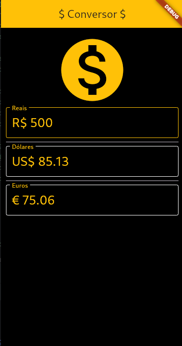

# Conversor de Moedas

Um aplicativo Flutter simples para converter valores entre Reais (BRL), Dólares (USD) e Euros (EUR). O app utiliza uma API pública para obter as taxas de câmbio mais recentes.

## Funcionalidades

*   Conversão em tempo real entre Reais, Dólares e Euros.
*   Atualização automática das taxas de câmbio ao iniciar o aplicativo.
*   Limpeza dos campos de texto ao apagar o valor em qualquer campo.
*   Feedback visual de "Carregando Dados..." enquanto as taxas são obtidas.
*   Mensagem de erro caso a API não responda.

## Tecnologias Utilizadas

* [Flutter](https://flutter.dev/) - Framework para desenvolvimento da interface do usuário.
*   [Dart](https://dart.dev/) - Linguagem de programação utilizada pelo Flutter.
*   [http](https://pub.dev/packages/http) - Pacote para fazer requisições HTTP à API de taxas de câmbio.
*   [API HG Brasil Finance](https://hgbrasil.com/status/finance) -  API utilizada para obter as taxas de câmbio atualizadas.

## Capturas de tela

